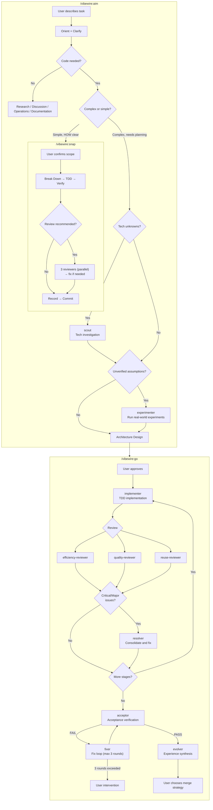

# VibeWire

[中文](README.zh-CN.md) | **English**

An autonomous development workflow plugin for Claude Code. From a task description to tested, reviewed code — without human intervention.

VibeWire orchestrates a pipeline of specialized agents that plan, implement, review, and iterate on your behalf. You describe what you want. The agents figure out how.

---

## How It Works

It starts with your project. Run `/vibewire:intro` once to scan the codebase and establish a documentation baseline.

Choose the right skill for your task:

- **Aim** — For exploration, research, discussion, and architecture planning. Aim clarifies requirements, investigates unknowns, and when needed, designs architecture with a staged delivery plan. When a task involves new technologies or unverified assumptions, aim dispatches **scout** to investigate and **experimenter** to run real-world experiments — grounding architecture decisions in verified data. If code is needed, aim transitions to snap or produces PLAN documents for go.
- **Snap** — For well-defined implementation tasks. Snap handles the entire cycle: break down → TDD → verify → optional review → record → commit. Review is recommended for changes spanning 3+ files or affecting public APIs.

For aim tasks that produce a PLAN, run `/vibewire:go`. The go command dispatches agents through a stage-by-stage pipeline:

1. For each stage, **implementer** reads the architecture, loads atomic changes, and executes with strict TDD
2. Three reviewers — **efficiency**, **quality**, **reuse** — inspect the result in parallel
3. If Critical/Major issues are found, **resolver** consolidates findings and applies minimal fixes
4. After all stages, **acceptor** performs full acceptance verification against architecture
5. If issues are found, **fixer** enters a repair loop (up to 3 rounds)
6. **evolver** analyzes health patterns, distills lessons learned, and updates project documentation

Each stage is a self-contained loop: implement → review → fix. If an implementer gets blocked, it retries automatically (up to twice before escalating to you). After all stages, acceptance verification ensures requirements are met before merge.

All process artifacts live in `.vibewire/` inside your project — architecture, stage designs, implementation records, review reports, and experience logs. Nothing is hidden. You can trace every decision.

---

## Installation

### Claude Code (via Plugin Marketplace)

Register the marketplace first, then install the plugin:

```bash
claude plugins marketplace add https://github.com/owniai/vibewire
claude plugins install vibewire@vibewire
```

---

## Quick Start

```bash
# Step 1: Scan your project (run once)
/vibewire:intro

# Step 2: Choose the right skill for your task
/vibewire:aim   # Explore, clarify, plan architecture if needed → /vibewire:go
/vibewire:snap  # Direct implementation: break down → TDD → verify → optional review → commit

# Step 3 (aim only): Execute the plan autonomously
/vibewire:go PLAN-{N}-{name}
```

---

## The Workflow

| Command / Skill | Purpose | When to Use |
|-----------------|---------|-------------|
| `/vibewire:intro` | Scan project, establish documentation baseline | Once per project, or when the codebase has changed significantly |
| `/vibewire:aim` | Exploration, clarification, and architecture planning | When you need to explore, analyze, decide, or plan before coding |
| `/vibewire:snap` | TDD implementation with optional review | When you know what to build and want to code it |
| `/vibewire:go` | Autonomous stage-by-stage implementation with review loops | After aim produces architecture |

```
/vibewire:intro → .vibewire/project.md, .vibewire/CHANGELOG.md

/vibewire:aim (exploration and planning):
  → orient (read project context)
  → clarify (what, why, how)
  → research / discussion / operations / documentation
  → (optional) .vibewire/aims/AIM-{N}-{name}.md
  → if architecture planning needed:
      → explore architecture (layer by layer)
      → scout (if tech unknowns) → .vibewire/tech-research/{task-id}.md + .vibewire/tech-research/knowledge.md
      → experimenter (if unverified assumptions) → .vibewire/experiments/{task-id}/
      → .vibewire/actions/PLAN-{N}-{name}/architecture.md
      → (user reviews and approves)
  → may transition to snap if code change is simple

/vibewire:snap (implementation):
  → break down → confirm
  → TDD (red → green) per atomic change
  → verify (full test suite)
  → review decision (self-review always; optional 3 reviewers in parallel)
  → fix (deduplicate findings, fix or skip)
  → .vibewire/actions/{name}.md + .vibewire/evolve.md
  → commit

/vibewire:go PLAN-{N}-{name}
  → feature branch
  → for each stage:
      implementer → code + tests (TDD)
      3 reviewers → findings
      resolver → fixes (if Critical/Major)
  → acceptor → acceptance verification
  → fixer → fix loop (if FAIL, max 3 rounds)
  → evolver → experience log + project docs update
  → (user chooses merge strategy)
```

---

## What's Inside

### Commands (2)

| Command | Description |
|---------|-------------|
| **intro** | Scans the codebase, establishes documentation baseline (`.vibewire/project.md`, `.vibewire/CHANGELOG.md`). Five steps: confirm scope → explore → write docs → review → commit |
| **go** | Iterative stage-based delivery. Dispatches agents in sequence through implementation, review, acceptance, and wrap-up stages |

### Skills (2)

| Skill | Description |
|-------|-------------|
| **aim** | Exploration, clarification, and architecture planning: orient → clarify → research / discussion / architecture design. Produces PLAN documents for /vibewire:go |
| **snap** | TDD implementation with optional review: break down → implement → verify → review decision → record → commit |

### Agents (10)

| Agent | Role | Used By |
|-------|------|---------|
| **scout** | Investigates specified technologies and dependencies with factual findings — versions, compatibility, constraints. Receives research targets, no decision-making | aim |
| **experimenter** | Runs specified experiments to obtain real structures, API behaviors, or performance data. Receives experiment targets, no decision-making | aim |
| **implementer** | Reads architecture context, assesses drift, loads atomic changes from stage plan, executes per-task TDD — write test, write code, verify, fix | go |
| **efficiency-reviewer** | Reviews for performance issues — unnecessary work, missed concurrency, memory leaks, algorithmic inefficiency | snap, go |
| **quality-reviewer** | Reviews for anti-patterns — redundant state, parameter creep, copy-paste variants, over-abstraction, code smells | snap, go |
| **reuse-reviewer** | Reviews for duplication — searches existing utilities and patterns to identify reusable code opportunities | snap, go |
| **resolver** | Consolidates review reports from all three reviewers, deduplicates findings, cross-validates issues, executes minimal fixes | go |
| **acceptor** | Post-implementation acceptance — verifies requirements traceability and hunts for hidden bugs through adversarial analysis | go |
| **fixer** | Fixes bugs and partial requirements identified during acceptance verification. Test-first discipline with minimal changes | go |
| **evolver** | Analyzes project health patterns from review/adjudication data, maintains evolve.md with health dashboard and experience records, updates project documentation | go |

---

## Architecture

### Process Artifacts

All process artifacts are stored in `.vibewire/` within the target project:

```
.vibewire/
├── project.md                          # Project overview (created by intro)
├── CHANGELOG.md                        # Change log (created by intro)
├── evolve.md                           # Cross-milestone experience and health dashboard (created by evolver)
├── tech-research/                      # Tech research artifacts (created by scout)
│   ├── knowledge.md                    # Global research knowledge base
│   └── {task-id}.md                    # Detailed research per task
├── experiments/
│   ├── framework.md                    # Global experiment framework (created by experimenter)
│   └── {task-id}/                      # Experiment results (created by experimenter)
│       └── result.md
├── actions/                            # Action and plan records
│   ├── {name}.md                       # Action summary (created by snap)
│   └── PLAN-{N}-{name}/               # Planning directory per plan task
│       ├── architecture.md             # Architecture design with Stage Plan (created by aim)
│       ├── log.md                      # Execution log (created by implementer)
│       ├── lessons.md                  # Accumulated lessons (created by implementer, resolver, fixer)
│       ├── review-efficiency.md        # Efficiency review report
│       ├── review-quality.md           # Quality review report
│       ├── review-reuse.md             # Reuse review report
│       ├── resolve.md                  # Review adjudication record (created by resolver)
│       ├── acceptance.md               # Acceptance report (created by acceptor)
│       └── acceptance-{round}.md       # Archived acceptance reports (created by fixer)
└── aims/                               # Aim records (created by aim)
    └── AIM-{N}-{name}.md             # Analysis/research conclusions
```

### Agent Pipeline



---

## Philosophy

- **Autonomous by default** — You approve the design. The agents handle the rest.
- **Review before merge** — Three independent reviewers catch different classes of issues. Acceptor verifies every architectural requirement before merge. Nothing ships without review and acceptance.
- **Traceable process** — Every decision, every change, every review is recorded in `.vibewire/`.
- **Fix, don't skip** — Blocked agents trigger automatic rework. Issues are escalated, not ignored.
- **Scope discipline** — The aim skill pushes back on oversized tasks and helps you ship the smallest useful unit first.

---

## Updating

```bash
claude plugins update vibewire@vibewire
```

---

## Acknowledgments

VibeWire was inspired by [Superpowers](https://github.com/obra/superpowers) by Jesse Vincent. The following patterns and concepts were adapted from Superpowers:

- **Skill format** — Markdown with YAML frontmatter for metadata and structured sections for process, principles, and anti-patterns
- **Design-first workflow** — Requiring user-approved design documents before any implementation begins

## License

MIT License - see LICENSE file for details.
