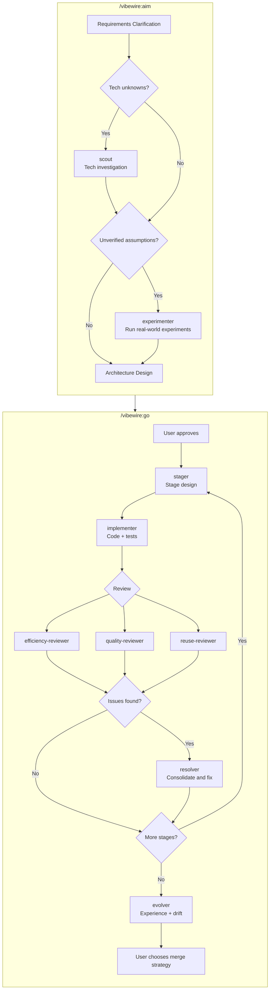

# VibeWire

An autonomous development workflow plugin for Claude Code. From a task description to tested, reviewed code — without human intervention.

VibeWire orchestrates a pipeline of specialized agents that plan, implement, review, and iterate on your behalf. You describe what you want. The agents figure out how.

---

## How It Works

It starts with your project. Run `/vibewire:intro` once to scan the codebase and establish a documentation baseline.

When you have a task, run `/vibewire:aim`. Through a structured conversation, the aim skill clarifies requirements with you, narrows scope if needed, and produces a requirements document and architecture design. When the task involves new technologies or unverified assumptions, aim dispatches **scout** to investigate tech facts and **experimenter** to run real-world experiments — grounding architecture decisions in verified data. You review and approve both before any code is written.

Then run `/vibewire:go`. The go skill dispatches agents through a stage-by-stage pipeline:

1. For each stage, **stager** designs fine-grained tasks with full implementation code
2. **Implementer** writes code and tests, runs them, and fixes failures until everything passes
3. Three reviewers — **efficiency**, **quality**, **reuse** — inspect the result in parallel
4. **Resolver** consolidates review findings and applies minimal fixes
5. After all stages, **evolver** distills lessons learned and records design drift

Each stage is a self-contained loop: design → implement → review → fix. If an implementer gets blocked, the stager reworks the design and the implementer retries automatically (up to twice before escalating to you).

All process artifacts live in `.vibewire/` inside your project — requirements, architecture, stage designs, implementation records, review reports, and experience logs. Nothing is hidden. You can trace every decision.

---

## Installation

### Claude Code (via Plugin Marketplace)

Register the marketplace first, then install the plugin:

```bash
/plugin marketplace add owniai/vibewire
/plugin install vibewire
```

### Manual Installation

Clone the repository and copy the components into your Claude Code configuration:

```bash
git clone https://github.com/owniai/vibewire.git

# Copy agents and skills
cp -r vibewire/agents ~/.claude/agents/
cp -r vibewire/skills ~/.claude/skills/
```

---

## Quick Start

```bash
# Step 1: Scan your project (run once)
/vibewire:intro

# Step 2: Define a task through collaborative dialogue
/vibewire:aim

# Step 3: Execute the plan autonomously
/vibewire:go 001-task-name
```

---

## The Workflow

| Skill | Purpose | When to Use |
|-------|---------|-------------|
| `/vibewire:intro` | Scan project, establish documentation baseline and shadow API files | Once per project, or when the codebase has changed significantly |
| `/vibewire:aim` | Collaborative requirements clarification and architecture design | Before each new feature or change |
| `/vibewire:go` | Autonomous stage-by-stage implementation with review loops | After aim produces requirements and architecture |

```
/vibewire:intro → .vibewire/project.md, .vibewire/CHANGELOG.md, .shadow/

/vibewire:aim → .vibewire/{N}-{name}/requirements.md
              → scout (if tech unknowns) → .vibewire/tech-research.md
              → experimenter (if unverified assumptions) → .vibewire/experiments/{N}-{name}/
              → .vibewire/{N}-{name}/architecture.md
              → (user reviews and approves)

/vibewire:go {N}-{name}
  → for each stage:
      stager → stage design
      implementer → code + tests
      3 reviewers → findings
      resolver → fixes
  → evolver → experience log
  → (user chooses how to merge)
```

---

## What's Inside

### Skills (3)

| Skill | Description |
|-------|-------------|
| **intro** | Scans the project, establishes documentation baseline (`.vibewire/project.md`, `.vibewire/CHANGELOG.md`), generates shadow API files |
| **aim** | Collaborative requirement clarification and architecture design. Dispatches scout for tech investigation and experimenter for real-world validation when needed. Produces `requirements.md` and `architecture.md` |
| **go** | Execution orchestrator. Dispatches agents in sequence through planning, implementation, and review stages |

### Agents (10)

| Agent | Role | Used By |
|-------|------|---------|
| **scout** | Investigates specified technologies and dependencies with factual findings — versions, compatibility, constraints | aim |
| **experimenter** | Runs specified experiments to obtain real structures, API behaviors, or performance data | aim |
| **stager** | Converts a stage plan into fine-grained tasks with full implementation code | go |
| **implementer** | Writes code from stage documents, writes and runs tests, fixes issues until all tests pass, then commits | go |
| **efficiency-reviewer** | Reviews for performance issues — unnecessary work, missed concurrency, memory leaks, algorithmic inefficiency | go |
| **quality-reviewer** | Reviews for anti-patterns — redundant state, parameter creep, copy-paste variants, over-abstraction, code smells | go |
| **reuse-reviewer** | Reviews for duplication — searches existing utilities and patterns to identify reusable code opportunities | go |
| **resolver** | Consolidates review reports from all three reviewers, deduplicates findings, cross-validates issues, executes minimal fixes | go |
| **evolver** | Distills execution experience and design drift from stage outputs, updates project-level documentation | go |
| **shadow-writer** | Extracts declarations from source files — all definitions without function bodies | intro |

---

## Architecture

### Directory Structure

```
vibewire/
├── .claude-plugin/
│   └── plugin.json           # Plugin metadata
├── agents/                   # 10 specialized agents
│   ├── scout.md
│   ├── experimenter.md
│   ├── stager.md
│   ├── implementer.md
│   ├── efficiency-reviewer.md
│   ├── quality-reviewer.md
│   ├── reuse-reviewer.md
│   ├── resolver.md
│   ├── evolver.md
│   └── shadow-writer.md
├── skills/                   # 3 workflow skills
│   ├── intro/SKILL.md
│   ├── aim/SKILL.md
│   └── go/SKILL.md
└── hooks/
    └── hooks.json            # Reserved for future automations
```

### Process Artifacts

All process artifacts are stored in `.vibewire/` within the target project:

```
.vibewire/
├── project.md                          # Project overview (created by intro)
├── CHANGELOG.md                        # Change log (created by intro)
├── tech-research.md                    # Tech investigation results (created by scout)
├── experiments/{N}-{name}/             # Experiment reports (created by experimenter)
│   └── experiment-report.md
├── evolve.md                            # Cross-milestone experience (created by evolver)
├── {N}-{name}/                         # Planning directory per task
│   ├── requirements.md                 # Requirements document (created by aim)
│   ├── architecture.md                 # Architecture design with Stage Plan (created by aim)
│   ├── stage-{M}-{name}.md            # Stage design (created by stager)
│   ├── evolve.md                       # Per-stage experience log (created by implementer, resolver)
│   └── drift.md                        # Design drift record (created by implementer, stager, evolver)
└── .shadow/                            # API declaration mirrors (created by intro)
    └── {path/to/source}.{ext}
```

### Agent Pipeline



---

## Philosophy

- **Autonomous by default** — You approve the design. The agents handle the rest.
- **Review before merge** — Three independent reviewers catch different classes of issues. Nothing ships without review.
- **Traceable process** — Every decision, every change, every review is recorded in `.vibewire/`.
- **Fix, don't skip** — Blocked agents trigger automatic rework. Issues are escalated, not ignored.
- **Scope discipline** — The aim skill pushes back on oversized tasks and helps you ship the smallest useful unit first.

---

## Updating

Update the plugin through the marketplace:

```bash
/plugin update vibewire
```

---

## Acknowledgments

VibeWire was inspired by [Superpowers](https://github.com/obra/superpowers) by Jesse Vincent. The following patterns and concepts were adapted from Superpowers:

- **Skill format** — Markdown with YAML frontmatter for metadata and structured sections for process, principles, and anti-patterns
- **Design-first workflow** — Requiring user-approved design documents before any implementation begins

## License

MIT License - see LICENSE file for details.
