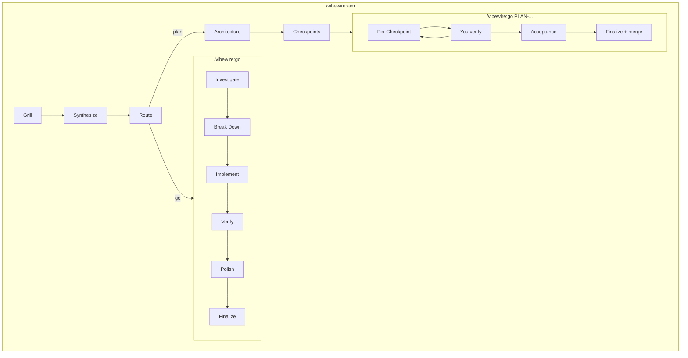

# VibeWire

[中文](README.zh-CN.md) | **English**

A development workflow plugin for Claude Code. Aim interviews to a shared spec; go implements — TDD, review, and commit.

You confirm direction. Agents execute the agreed scope.

---

## How It Works

Run `/vibewire:intro` once to scan the codebase and establish a documentation baseline.

Choose the skill for the work:

- **Aim** — Exploration, research, discussion, and architecture planning. Interviews in frontier rounds until shared understanding, recording domain language and ADRs as they crystallise. Optionally synthesizes a to-spec-style AIM, then routes: **go** or **plan**. You confirm which, and this session or a new one. Scout and experimenter run when facts or hypotheses need looking up — they do not decide.
- **Go** — Well-defined implementation. Investigate → break down → TDD (or direct) → verify → polish → finalize. Ad-hoc go asks before launching the three external reviewers; PLAN execution always launches them.

All process artifacts live in `.vibewire/` — architecture, checkpoint plans, AIM docs, and experience logs. Nothing is hidden.

---

## Installation

### Claude Code (via Plugin Marketplace)

Register the marketplace first, then install the plugin:

```bash
claude plugins marketplace add https://github.com/owniai/vibewire
claude plugins install vibewire@vibewire
```

---

## Quick Start

```bash
# Step 1: Scan your project (run once)
/vibewire:intro

# Step 2: Choose the skill
/vibewire:aim   # Explore, clarify, route to go or plan
/vibewire:go    # Implement: investigate → TDD → verify → polish → commit
```

---

## The Workflow

| Command / Skill | Purpose | When to Use |
|-----------------|---------|-------------|
| `/vibewire:intro` | Scan project, establish documentation baseline | Once per project, or when the codebase has changed significantly |
| `/vibewire:aim` | Exploration, clarification, and architecture planning | When you need to explore, analyze, decide, or plan before coding |
| `/vibewire:go` | Implementation with TDD and review | When you know what to build, or when executing a PLAN |

```
/vibewire:intro → .vibewire/project.md, .vibewire/CHANGELOG.md

/vibewire:aim:
  → Grill (frontier rounds; inline `.vibewire/CONTEXT.md` + `.vibewire/adr/`)
  → Synthesize (to-spec-style AIM, or skip) → Route
  → Route: recommend **go** or **plan**; you confirm which, and this session or a new one
  → (optional) `.vibewire/aims/AIM-{N}-{name}.md`

  plan:
      → architecture (layer by layer) → write architecture.md
      → checkpoints (approve all) → write checkpoints.md
      → Route: ask commit, then `/vibewire:go PLAN-{N}-{name}`

/vibewire:go (ad-hoc):
  → Investigate → confirm
  → Break Down → confirm
  → Implement (TDD red → green, or Direct) per atomic change
  → Verify (full test suite)
  → Polish (self-review; ask before 3 external reviewers)
  → Finalize (`.vibewire/CHANGELOG.md`, `.vibewire/evolve.md`) → commit

/vibewire:go PLAN-{N}-{name}:
  → branch `plan/PLAN-{N}-{name}`
  → per Checkpoint: Phases 1–5 (Polish always launches reviewers)
      → you verify → wrap up `log.md` → commit
  → Acceptance → Finalize (one changelog entry) → merge (you confirm)
```

---

## What's Inside

### Commands (1)

| Command | Description |
|---------|-------------|
| **intro** | Scans the codebase, establishes documentation baseline (`.vibewire/project.md` with Vibewire artifacts index, `.vibewire/CHANGELOG.md`). Five steps: confirm scope → explore → write docs → review → commit |

### Skills (2)

| Skill | Description |
|-------|-------------|
| **aim** | Interview and record domain memory, optional to-spec-style AIM, then route to **go** or **plan**. CONTEXT/ADR lazy; PLAN when architecture is needed |
| **go** | Investigate → break down → implement (TDD or direct) → verify → polish → finalize. Ad-hoc or `PLAN-{N}-{name}` checkpoint execution |

### Agents (5)

| Agent | Role | Used By |
|-------|------|---------|
| **scout** | Investigates specified technologies and dependencies — versions, compatibility, constraints. Receives research targets, no decision-making | aim |
| **experimenter** | Runs specified experiments for real structures, API behavior, or performance data. Receives experiment targets, no decision-making | aim |
| **efficiency-reviewer** | Reviews for performance — unnecessary work, missed concurrency, memory leaks, algorithmic inefficiency | go |
| **quality-reviewer** | Reviews for anti-patterns — redundant state, parameter creep, copy-paste variants, over-abstraction, code smells | go |
| **reuse-reviewer** | Reviews for duplication — searches existing utilities and patterns for reuse | go |

---

## Architecture

### Process Artifacts

All process artifacts are stored in `.vibewire/` within the target project:

```
.vibewire/
├── project.md                          # Project overview (created by intro; Vibewire artifacts index)
├── CONTEXT.md                          # Domain glossary (lazy; created by aim during interview)
├── adr/                                # Architecture Decision Records (lazy; created by aim)
│   └── 0001-{slug}.md
├── CHANGELOG.md                        # Change log (created by intro; updated by go finalize)
├── evolve.md                           # Reusable lessons (maintained by go)
├── tech-research/                      # Tech research artifacts (created by scout)
│   ├── knowledge.md                    # Global research knowledge base
│   └── {task-id}.md                    # Detailed research per task
├── experiments/
│   ├── framework.md                    # Global experiment framework (created by experimenter)
│   └── {task-id}/                      # Experiment results (created by experimenter)
│       └── result.md
├── plans/
│   └── PLAN-{N}-{name}/
│       ├── architecture.md             # Architecture (written after layers confirmed)
│       ├── checkpoints.md              # Delivery checkpoints + status header
│       └── log.md                      # Per-checkpoint drift + notes (created by go)
└── aims/
    └── AIM-{N}-{name}.md               # To-spec-style synthesis (optional)
```

### Agent Pipeline



---

## Philosophy

- **You confirm direction** — Skills recommend; you confirm routes, commits, and (ad-hoc) external review.
- **Review in the loop** — Self-review always. External reviewers on ask; always during PLAN execution.
- **Traceable process** — Decisions and delivery live in `.vibewire/`.
- **Fix with judgment** — Merge findings; fix what improves the change, skip what would disrupt more.

---

## Updating

```bash
claude plugins update vibewire@vibewire
```

---

## Acknowledgments

VibeWire was inspired by [Superpowers](https://github.com/obra/superpowers) by Jesse Vincent. The following patterns and concepts were adapted from Superpowers:

- **Skill format** — Markdown with YAML frontmatter for metadata and structured sections for process, principles, and anti-patterns
- **Design-first workflow** — Requiring user-approved design documents before any implementation begins

## License

MIT License - see LICENSE file for details.
