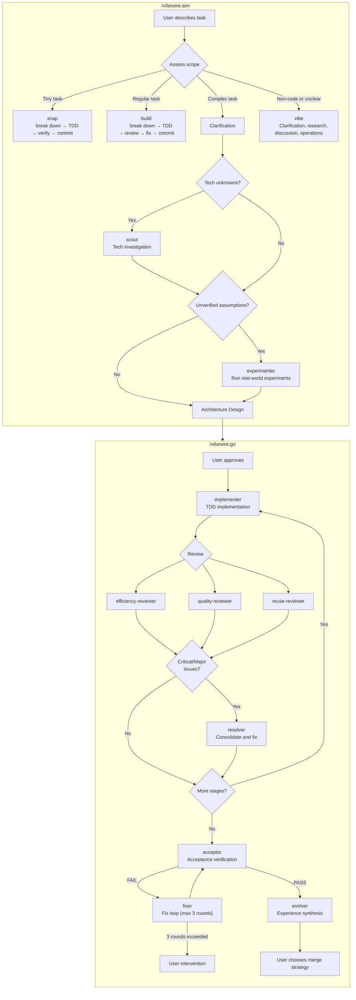

# VibeWire

[中文](README.zh-CN.md) | **English**

An autonomous development workflow plugin for Claude Code. From a task description to tested, reviewed code — without human intervention.

VibeWire orchestrates a pipeline of specialized agents that plan, implement, review, and iterate on your behalf. You describe what you want. The agents figure out how.

---

## How It Works

It starts with your project. Run `/vibewire:intro` once to scan the codebase and establish a documentation baseline.

When you have a task, run `/vibewire:aim`. Aim assesses the task scope and routes to the appropriate flow:

- **Snap** — For tiny, well-defined tasks (single-function fixes, config adjustments, mechanical refactors). Snap handles the entire cycle: break down → TDD → verify → record → commit. No parallel review.
- **Build** — For regular tasks involving cross-module coordination or structural additions. Build handles the entire cycle: break down → TDD → verify → three-way review → fix → record → commit.
- **Plan** — For complex feature work involving multiple modules, unclear requirements, or architectural decisions. Through a structured conversation, plan clarifies requirements, narrows scope, and produces a requirements document and architecture design. When the task involves new technologies or unverified assumptions, plan dispatches **scout** to investigate tech facts and **experimenter** to run real-world experiments — grounding architecture decisions in verified data. You review and approve both before any code is written.
- **Vibe** — For non-implementation tasks: clarification, research, discussion, or operations. Also routes here when requirements are unclear and need further clarification. Produces insights or executes operations without code changes.

For plan tasks, run `/vibewire:go`. The go command dispatches agents through a stage-by-stage pipeline:

1. For each stage, **implementer** reads the architecture, breaks down tasks, and executes with strict TDD
2. Three reviewers — **efficiency**, **quality**, **reuse** — inspect the result in parallel
3. If Critical/Major issues are found, **resolver** consolidates findings and applies minimal fixes
4. After all stages, **acceptor** performs full acceptance verification against requirements
5. If issues are found, **fixer** enters a repair loop (up to 3 rounds)
6. **evolver** analyzes health patterns, distills lessons learned, and updates project documentation

Each stage is a self-contained loop: implement → review → fix. If an implementer gets blocked, it retries automatically (up to twice before escalating to you). After all stages, acceptance verification ensures requirements are met before merge.

All process artifacts live in `.vibewire/` inside your project — requirements, architecture, stage designs, implementation records, review reports, and experience logs. Nothing is hidden. You can trace every decision.

---

## Installation

### Claude Code (via Plugin Marketplace)

Register the marketplace first, then install the plugin:

```bash
claude plugins install vibewire@vibewire
```

---

## Quick Start

```bash
# Step 1: Scan your project (run once)
/vibewire:intro

# Step 2: Define and execute a task
/vibewire:aim  # Routes to snap, build, plan, or vibe based on task scope
               # Snap: break down → TDD → verify → record → commit
               # Build: break down → TDD → verify → review → fix → record → commit
               # Plan: clarification → requirements → architecture → /vibewire:go
               # Vibe: clarification, research, discussion, or operations

# Step 3 (plan only): Execute the plan autonomously
/vibewire:go PLAN-{N}-{name}
```

---

## The Workflow

| Command / Skill | Purpose | When to Use |
|-----------------|---------|-------------|
| `/vibewire:intro` | Scan project, establish documentation baseline | Once per project, or when the codebase has changed significantly |
| `/vibewire:aim` | Assesses task scope, routes to snap, build, plan, or vibe | Before each new task or change |
| `/vibewire:go` | Autonomous stage-by-stage implementation with review loops | After aim produces requirements and architecture |

```
/vibewire:intro → .vibewire/project.md, .vibewire/CHANGELOG.md

/vibewire:aim
  ├─ snap (tiny tasks):
  │   → break down → confirm
  │   → TDD (red → green) per atomic change
  │   → verify (full test suite)
  │   → .vibewire/actions/{name}.md + .vibewire/evolve.md
  │   → commit
  │
  ├─ build (regular tasks):
  │   → break down → confirm
  │   → TDD (red → green) per atomic change
  │   → verify (full test suite)
  │   → 3 reviewers (parallel, inline mode)
  │   → fix (deduplicate, fix or skip)
  │   → .vibewire/actions/{name}.md + .vibewire/evolve.md
  │   → commit
  │
  ├─ plan (complex tasks):
  │   → clarification (one question per turn)
  │   → .vibewire/actions/PLAN-{N}-{name}/requirements.md
  │   → explore architecture (layer by layer)
  │   → scout (if tech unknowns) → .vibewire/tech-research/{task-id}.md + .vibewire/tech-research/knowledge.md
  │   → experimenter (if unverified assumptions) → .vibewire/experiments/{task-id}/
  │   → .vibewire/actions/PLAN-{N}-{name}/architecture.md
  │   → (user reviews and approves)
  │
  └─ vibe (non-implementation tasks):
      → clarification → research / discussion / operations
      → (optional) .vibewire/vibes/VIBE-{N}-{name}.md
      → may transition to snap/build/plan if code change is needed

/vibewire:go PLAN-{N}-{name}
  → feature branch
  → for each stage:
      implementer → code + tests (TDD)
      3 reviewers → findings
      resolver → fixes (if Critical/Major)
  → acceptor → acceptance verification
  → fixer → fix loop (if FAIL, max 3 rounds)
  → evolver → experience log + project docs update
  → (user chooses merge strategy)
```

---

## What's Inside

### Commands (2)

| Command | Description |
|---------|-------------|
| **intro** | Scans the codebase, establishes documentation baseline (`.vibewire/project.md`, `.vibewire/CHANGELOG.md`). Five steps: confirm scope → explore → write docs → review → commit |
| **go** | Iterative stage-based delivery. Dispatches agents in sequence through implementation, review, acceptance, and wrap-up stages |

### Skills (1)

| Skill | Description |
|-------|-------------|
| **aim** | Entry-point routing flow. Three steps: orient → clarify intent → route to snap, build, plan, or vibe |

### Agents (10)

| Agent | Role | Used By |
|-------|------|---------|
| **scout** | Investigates specified technologies and dependencies with factual findings — versions, compatibility, constraints. Receives research targets, no decision-making | aim |
| **experimenter** | Runs specified experiments to obtain real structures, API behaviors, or performance data. Receives experiment targets, no decision-making | aim |
| **implementer** | Reads architecture context, assesses drift, breaks down tasks, executes per-task TDD — write test, write code, verify, fix | go |
| **efficiency-reviewer** | Reviews for performance issues — unnecessary work, missed concurrency, memory leaks, algorithmic inefficiency | aim, go |
| **quality-reviewer** | Reviews for anti-patterns — redundant state, parameter creep, copy-paste variants, over-abstraction, code smells | aim, go |
| **reuse-reviewer** | Reviews for duplication — searches existing utilities and patterns to identify reusable code opportunities | aim, go |
| **resolver** | Consolidates review reports from all three reviewers, deduplicates findings, cross-validates issues, executes minimal fixes | go |
| **acceptor** | Post-implementation acceptance — verifies requirements traceability and hunts for hidden bugs through adversarial analysis | go |
| **fixer** | Fixes bugs and partial requirements identified during acceptance verification. Test-first discipline with minimal changes | go |
| **evolver** | Analyzes project health patterns from review/adjudication data, maintains evolve.md with health dashboard and experience records, updates project documentation | go |

---

## Architecture

### Directory Structure

```
vibewire/
├── .claude-plugin/
│   └── plugin.json           # Plugin metadata
├── agents/                   # 10 specialized agents
│   ├── acceptor.md
│   ├── efficiency-reviewer.md
│   ├── evolver.md
│   ├── experimenter.md
│   ├── fixer.md
│   ├── implementer.md
│   ├── quality-reviewer.md
│   ├── resolver.md
│   ├── reuse-reviewer.md
│   └── scout.md
├── commands/                 # 2 slash commands
│   ├── go.md                 # Stage-based delivery: implement → review → accept → merge
│   └── intro.md              # Project scan and documentation baseline
├── skills/                   # 1 workflow skill
│   └── aim/
│       ├── SKILL.md          # Router: orient → clarify → route to snap, build, plan, or vibe
│       ├── snap.md           # Tiny flow: break down → TDD → verify → commit
│       ├── build.md          # Regular flow: break down → TDD → review → fix → commit
│       ├── plan.md           # Complex flow: clarify → requirements → architecture → /vibewire:go
│       └── vibe.md           # Non-implementation flow: clarification, research, discussion, operations
```

### Process Artifacts

All process artifacts are stored in `.vibewire/` within the target project:

```
.vibewire/
├── project.md                          # Project overview (created by intro)
├── CHANGELOG.md                        # Change log (created by intro)
├── evolve.md                           # Cross-milestone experience and health dashboard (created by evolver)
├── tech-research/                      # Tech research artifacts (created by scout)
│   ├── knowledge.md                    # Global research knowledge base
│   └── {task-id}.md                    # Detailed research per task
├── experiments/
│   ├── framework.md                    # Global experiment framework (created by experimenter)
│   └── {task-id}/                      # Experiment results (created by experimenter)
│       └── result.md
├── actions/                            # Action and plan records
│   ├── {name}.md                       # Action summary (created by aim snap/build)
│   └── PLAN-{N}-{name}/               # Planning directory per plan task
│       ├── requirements.md             # Requirements document (created by aim plan)
│       ├── architecture.md             # Architecture design with Stage Plan (created by aim plan)
│       ├── log.md                      # Execution log (created by implementer)
│       ├── lessons.md                  # Accumulated lessons (created by implementer, resolver, fixer)
│       ├── review-efficiency.md        # Efficiency review report
│       ├── review-quality.md           # Quality review report
│       ├── review-reuse.md             # Reuse review report
│       ├── resolve.md                  # Review adjudication record (created by resolver)
│       ├── acceptance.md               # Acceptance report (created by acceptor)
│       └── acceptance-{round}.md       # Archived acceptance reports (created by fixer)
└── vibes/                              # Vibe records (created by aim vibe)
    └── VIBE-{N}-{name}.md             # Analysis/research conclusions
```

### Agent Pipeline



---

## Philosophy

- **Autonomous by default** — You approve the design. The agents handle the rest.
- **Review before merge** — Three independent reviewers catch different classes of issues. Acceptor verifies every requirement before merge. Nothing ships without review and acceptance.
- **Traceable process** — Every decision, every change, every review is recorded in `.vibewire/`.
- **Fix, don't skip** — Blocked agents trigger automatic rework. Issues are escalated, not ignored.
- **Scope discipline** — The aim skill pushes back on oversized tasks and helps you ship the smallest useful unit first.

---

## Updating

```bash
claude plugins update vibewire@vibewire
```

---

## Acknowledgments

VibeWire was inspired by [Superpowers](https://github.com/obra/superpowers) by Jesse Vincent. The following patterns and concepts were adapted from Superpowers:

- **Skill format** — Markdown with YAML frontmatter for metadata and structured sections for process, principles, and anti-patterns
- **Design-first workflow** — Requiring user-approved design documents before any implementation begins

## License

MIT License - see LICENSE file for details.
