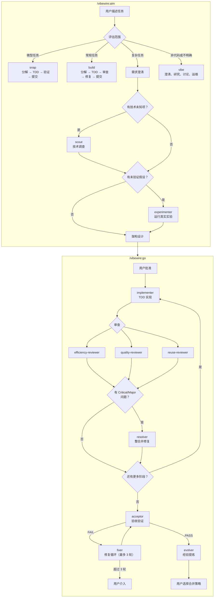

# VibeWire

**中文** | [English](README.md)

Claude Code 的自主开发工作流插件。从任务描述到测试通过、审查完成的代码——无需人工干预。

VibeWire 编排一组专业化的 Agent 流水线，代表你完成规划、实现、审查和迭代。你描述想要什么，Agent 负责怎么做。

---

## 工作原理

首先运行 `/vibewire:intro` 扫描代码库，建立文档基线（每个项目运行一次）。

当你有任务时，运行 `/vibewire:aim`。Aim 评估任务范围并路由到对应流程：

- **Snap** — 适用于微小的、明确的任务（单函数修复、配置调整、机械化重构）。Snap 完成整个周期：分解 → TDD → 验证 → 记录 → 提交。无需并行审查。
- **Build** — 适用于涉及跨模块协调或结构性增加的常规任务。Build 完成整个周期：分解 → TDD → 验证 → 三方审查 → 修复 → 记录 → 提交。
- **Plan** — 适用于涉及多模块、需求不明确或需要架构决策的复杂功能。通过结构化对话，plan 澄清需求、收窄范围，生成需求文档和架构设计。当任务涉及新技术或未验证的假设时，plan 派遣 **scout** 调查技术事实，派遣 **experimenter** 运行真实实验——将架构决策建立在已验证的数据之上。你在编写任何代码之前审查并批准两者。
- **Vibe** — 适用于非实现类任务：澄清、研究、讨论或运维操作。当需求不明确需要进一步澄清时也会路由到此处。产出洞察或执行操作，不产生代码变更。

对于 plan 任务，运行 `/vibewire:go`。go 命令通过逐阶段流水线调度 Agent：

1. 对每个阶段，**implementer** 阅读架构、分解任务、以严格 TDD 执行
2. 三个审查者 — **efficiency**、**quality**、**reuse** — 并行检查结果
3. 如果发现 Critical/Major 级别问题，**resolver** 整合发现并应用最小修复
4. 所有阶段完成后，**acceptor** 针对需求进行完整验收验证
5. 如果发现问题，**fixer** 进入修复循环（最多 3 轮）
6. **evolver** 分析健康模式、提炼经验教训、更新项目文档

每个阶段是自包含的循环：实现 → 审查 → 修复。如果 implementer 被阻塞，会自动重试（最多两次后升级给你）。所有阶段完成后，验收验证确保需求在合并前得到满足。

所有过程产物存放在项目内的 `.vibewire/` 目录——需求、架构、阶段设计、实现记录、审查报告和经验日志。一切透明可追溯。

---

## 安装

### Claude Code（通过插件市场）

先注册市场，然后安装插件：

```bash
claude plugins install vibewire@vibewire
```

---

## 快速开始

```bash
# 第 1 步：扫描项目（运行一次）
/vibewire:intro

# 第 2 步：定义并执行任务
/vibewire:aim  # 根据任务范围路由到 snap、build、plan 或 vibe
               # Snap: 分解 → TDD → 验证 → 记录 → 提交
               # Build: 分解 → TDD → 验证 → 审查 → 修复 → 记录 → 提交
               # Plan: 澄清 → 需求 → 架构 → /vibewire:go
               # Vibe: 澄清、研究、讨论或运维操作

# 第 3 步（仅 plan）: 自主执行计划
/vibewire:go PLAN-{N}-{name}
```

---

## 工作流

| 命令 / Skill | 用途 | 何时使用 |
|-------|------|----------|
| `/vibewire:intro` | 扫描项目，建立文档基线 | 每个项目一次，或代码库发生重大变化时 |
| `/vibewire:aim` | 评估任务范围，路由到 snap、build、plan 或 vibe | 每个新任务或变更之前 |
| `/vibewire:go` | 自主逐阶段实现，含审查循环 | aim 产出需求和架构之后 |

```
/vibewire:intro → .vibewire/project.md, .vibewire/CHANGELOG.md

/vibewire:aim
  ├─ snap（微型任务）:
  │   → 分解 → 确认
  │   → TDD（red → green）逐个原子变更
  │   → 验证（完整测试套件）
  │   → .vibewire/actions/{name}.md + .vibewire/evolve.md
  │   → commit
  │
  ├─ build（常规任务）:
  │   → 分解 → 确认
  │   → TDD（red → green）逐个原子变更
  │   → 验证（完整测试套件）
  │   → 3 个审查者（并行，inline 模式）
  │   → 修复（去重，修复或跳过）
  │   → .vibewire/actions/{name}.md + .vibewire/evolve.md
  │   → commit
  │
  ├─ plan（复杂任务）:
  │   → 澄清（每轮一个问题）
  │   → .vibewire/actions/PLAN-{N}-{name}/requirements.md
  │   → 探索架构（逐层确认）
  │   → scout（如有技术未知项）→ .vibewire/tech-research/{task-id}.md + .vibewire/tech-research/knowledge.md
  │   → experimenter（如有未验证假设）→ .vibewire/experiments/{task-id}/
  │   → .vibewire/actions/PLAN-{N}-{name}/architecture.md
  │   → （用户审查并批准）
  │
  └─ vibe（非实现任务）:
      → 澄清 → 研究 / 讨论 / 运维
      → （可选）.vibewire/vibes/VIBE-{N}-{name}.md
      → 如需代码变更可转入 snap/build/plan

/vibewire:go PLAN-{N}-{name}
  → 创建 feature 分支
  → 逐阶段执行:
      implementer → 代码 + 测试（TDD）
      3 个审查者 → 审查报告
      resolver → 修复（如有 Critical/Major）
  → acceptor → 验收验证
  → fixer → 修复循环（如 FAIL，最多 3 轮）
  → evolver → 经验日志 + 项目文档更新
  → （用户选择合并策略）
```

---

## 内容概览

### Commands（2 个）

| Command | 描述 |
|---------|------|
| **intro** | 扫描代码库，建立文档基线（`.vibewire/project.md`、`.vibewire/CHANGELOG.md`）。五步：确认范围 → 探索 → 写文档 → 审查 → 提交 |
| **go** | 迭代式分阶段交付。按实现、审查、验收和收尾阶段顺序调度 Agent |

### Skills（1 个）

| Skill | 描述 |
|-------|------|
| **aim** | 入口路由流程。三步：定位 → 澄清意图 → 路由到 snap、build、plan 或 vibe |

### Agents（10 个）

| Agent | 职责 | 使用方 |
|-------|------|--------|
| **scout** | 调查指定技术和依赖，产出事实性发现——版本、兼容性、约束。接收研究目标，不做决策 | aim |
| **experimenter** | 运行指定实验，获取真实结构、API 行为或性能数据。接收实验目标，不做决策 | aim |
| **implementer** | 阅读架构上下文，评估偏差，分解任务，逐任务 TDD——写测试、写代码、验证、修复 | go |
| **efficiency-reviewer** | 审查性能问题——不必要的计算、错失的并发、内存泄漏、算法低效 | aim, go |
| **quality-reviewer** | 审查反模式——冗余状态、参数膨胀、复制粘贴变体、过度抽象、代码异味 | aim, go |
| **reuse-reviewer** | 审查重复代码——搜索已有工具函数和模式，识别可复用的代码机会 | aim, go |
| **resolver** | 整合三个审查者的报告，去重发现，交叉验证问题，执行最小修复 | go |
| **acceptor** | 实现后验收——通过对抗性分析验证需求可追溯性，搜寻隐藏缺陷 | go |
| **fixer** | 修复验收中发现的问题和部分需求。测试驱动，最小变更 | go |
| **evolver** | 从审查/裁决数据中分析项目健康模式，维护 evolve.md 健康面板和经验记录，更新项目文档 | go |

---

## 架构

### 目录结构

```
vibewire/
├── .claude-plugin/
│   └── plugin.json           # 插件元数据
├── agents/                   # 10 个专业 Agent
│   ├── acceptor.md
│   ├── efficiency-reviewer.md
│   ├── evolver.md
│   ├── experimenter.md
│   ├── fixer.md
│   ├── implementer.md
│   ├── quality-reviewer.md
│   ├── resolver.md
│   ├── reuse-reviewer.md
│   └── scout.md
├── commands/                 # 2 个 slash 命令
│   ├── go.md                 # 分阶段交付：实现 → 审查 → 验收 → 合并
│   └── intro.md              # 项目扫描和文档基线
├── skills/                   # 1 个工作流 Skill
│   └── aim/
│       ├── SKILL.md          # 路由器：定位 → 澄清 → 路由到 snap、build、plan 或 vibe
│       ├── snap.md           # 微型流程：分解 → TDD → 验证 → 提交
│       ├── build.md          # 常规流程：分解 → TDD → 审查 → 修复 → 提交
│       ├── plan.md           # 复杂流程：澄清 → 需求 → 架构 → /vibewire:go
│       └── vibe.md           # 非实现流程：澄清、研究、讨论、运维
```

### 过程产物

所有过程产物存放在目标项目的 `.vibewire/` 目录：

```
.vibewire/
├── project.md                          # 项目概览（由 intro 创建）
├── CHANGELOG.md                        # 变更日志（由 intro 创建）
├── evolve.md                           # 跨里程碑经验和健康面板（由 evolver 创建）
├── tech-research/                      # 技术调研产物（由 scout 创建）
│   ├── knowledge.md                    # 全局调研知识库
│   └── {task-id}.md                    # 每个任务的详细调研
├── experiments/
│   ├── framework.md                    # 全局实验框架（由 experimenter 创建）
│   └── {task-id}/                      # 实验结果（由 experimenter 创建）
│       └── result.md
├── actions/                            # Action 和 Plan 记录
│   ├── {name}.md                       # Action 摘要（由 aim snap/build 创建）
│   └── PLAN-{N}-{name}/               # 每个 plan 任务的规划目录
│       ├── requirements.md             # 需求文档（由 aim plan 创建）
│       ├── architecture.md             # 架构设计含 Stage Plan（由 aim plan 创建）
│       ├── log.md                      # 执行日志（由 implementer 创建）
│       ├── lessons.md                  # 累积经验（由 implementer、resolver、fixer 创建）
│       ├── review-efficiency.md        # 效率审查报告
│       ├── review-quality.md           # 质量审查报告
│       ├── review-reuse.md             # 复用审查报告
│       ├── resolve.md                  # 审查裁决记录（由 resolver 创建）
│       ├── acceptance.md               # 验收报告（由 acceptor 创建）
│       └── acceptance-{round}.md       # 归档的验收报告（由 fixer 创建）
└── vibes/                              # Vibe 记录（由 aim vibe 创建）
    └── VIBE-{N}-{name}.md             # 分析/研究结论
```

### Agent 流水线



---

## 设计理念

- **默认自主** — 你批准设计，Agent 处理其余一切。
- **合并前审查** — 三个独立审查者捕获不同类别的问题。Acceptor 在合并前验证每个需求。没有未经审查和验收的代码上线。
- **过程可追溯** — 每个决策、每次变更、每份审查都记录在 `.vibewire/` 中。
- **修复而非跳过** — 被阻塞的 Agent 触发自动返工。问题会被升级，不会被忽略。
- **范围自律** — aim 技能会对过大的任务提出质疑，帮助你优先交付最小的可用单元。

---

## 更新

```bash
claude plugins update vibewire@vibewire
```

---

## 致谢

VibeWire 受到了 Jesse Vincent 的 [Superpowers](https://github.com/obra/superpowers) 项目启发。以下模式和概念改编自 Superpowers：

- **Skill 格式** — 使用 YAML frontmatter 元数据和结构化章节来描述流程、原则和反模式的 Markdown 格式
- **设计先行工作流** — 在任何实现开始之前要求用户批准设计文档

## 许可证

MIT License - 详见 LICENSE 文件。
