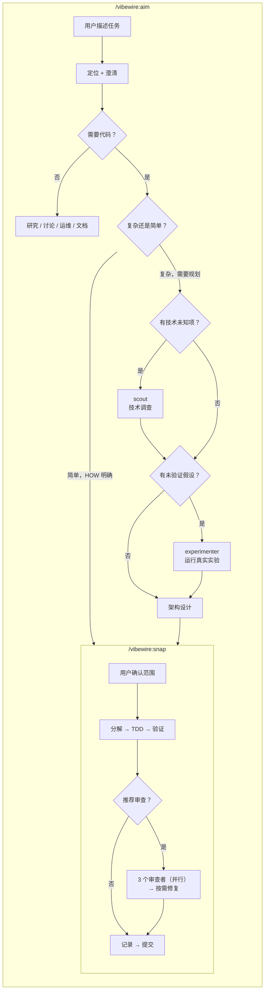

# VibeWire

**中文** | [English](README.md)

Claude Code 的自主开发工作流插件。从任务描述到测试通过、审查完成的代码——无需人工干预。

VibeWire 编排一组专业化的 Agent 流水线，代表你完成规划、实现、审查和迭代。你描述想要什么，Agent 负责怎么做。

---

## 工作原理

首先运行 `/vibewire:intro` 扫描代码库，建立文档基线（每个项目运行一次）。

根据任务选择合适的 skill：

- **Aim** — 适用于探索、研究、讨论和架构规划。Aim 澄清需求、调查未知项，必要时设计架构并生成基于检查点的交付计划。当任务涉及新技术或未验证的假设时，aim 派遣 **scout** 调查技术事实，派遣 **experimenter** 运行真实实验——将架构决策建立在已验证的数据之上。如果需要编码，aim 转向 snap 或产出 PLAN 文档（架构 + 检查点计划）。
- **Snap** — 适用于明确的实现任务。Snap 完成整个周期：分解 → TDD → 验证 → 可选审查 → 记录 → 提交。当变更涉及 3+ 文件或影响公共 API 时推荐进行审查。

所有过程产物存放在项目内的 `.vibewire/` 目录——架构、检查点计划、实现记录、审查报告和经验日志。一切透明可追溯。

---

## 安装

### Claude Code（通过插件市场）

先注册市场，然后安装插件：

```bash
claude plugins marketplace add https://github.com/owniai/vibewire
claude plugins install vibewire@vibewire
```

---

## 快速开始

```bash
# 第 1 步：扫描项目（运行一次）
/vibewire:intro

# 第 2 步：根据任务选择合适的 skill
/vibewire:aim   # 探索、澄清、按需架构规划
/vibewire:snap  # 直接实现：分解 → TDD → 验证 → 可选审查 → 提交
```

---

## 工作流

| 命令 / Skill | 用途 | 何时使用 |
|-------|------|----------|
| `/vibewire:intro` | 扫描项目，建立文档基线 | 每个项目一次，或代码库发生重大变化时 |
| `/vibewire:aim` | 探索、澄清和架构规划 | 需要在编码前探索、分析、决策或规划时 |
| `/vibewire:snap` | TDD 实现，可选审查 | 知道要构建什么，直接编码时 |

```
/vibewire:intro → .vibewire/project.md, .vibewire/CHANGELOG.md

/vibewire:aim（探索与规划）:
  → 定位（读取项目上下文）
  → 澄清（what、why、how）
  → 研究 / 讨论 / 运维 / 文档
  → （可选）.vibewire/aims/AIM-{N}-{name}.md
  → 如需架构规划:
      → 探索架构（逐层确认）
      → scout（如有技术未知项）→ .vibewire/tech-research/{task-id}.md + .vibewire/tech-research/knowledge.md
      → experimenter（如有未验证假设）→ .vibewire/experiments/{task-id}/
      → .vibewire/plans/PLAN-{N}-{name}/（architecture.md + checkpoints.md）
      → （用户审查并批准）
      → 移交 snap：/vibewire:snap PLAN-{N}-{name}（执行检查点）
  → 或变更简单时直接转入 snap

/vibewire:snap（实现）:
  → 分解 → 确认
  → TDD（red → green）逐个原子变更
  → 验证（完整测试套件）
  → 审查决策（始终自审；可选 3 个审查者并行）
  → 修复（去重发现，修复或跳过）
  → .vibewire/CHANGELOG.md + .vibewire/evolve.md
  → commit
```

---

## 内容概览

### Commands（1 个）

| Command | 描述 |
|---------|------|
| **intro** | 扫描代码库，建立文档基线（`.vibewire/project.md`、`.vibewire/CHANGELOG.md`）。五步：确认范围 → 探索 → 写文档 → 审查 → 提交 |

### Skills（2 个）

| Skill | 描述 |
|-------|------|
| **aim** | 探索、澄清和架构规划：定位 → 澄清 → 研究 / 讨论 / 架构设计。产出 PLAN 文档（架构 + 检查点计划） |
| **snap** | TDD 实现，可选审查：分解 → 实现 → 验证 → 审查决策 → 记录 → 提交 |

### Agents（5 个）

| Agent | 职责 | 使用方 |
|-------|------|--------|
| **scout** | 调查指定技术和依赖，产出事实性发现——版本、兼容性、约束。接收研究目标，不做决策 | aim |
| **experimenter** | 运行指定实验，获取真实结构、API 行为或性能数据。接收实验目标，不做决策 | aim |
| **efficiency-reviewer** | 审查性能问题——不必要的计算、错失的并发、内存泄漏、算法低效 | snap |
| **quality-reviewer** | 审查反模式——冗余状态、参数膨胀、复制粘贴变体、过度抽象、代码异味 | snap |
| **reuse-reviewer** | 审查重复代码——搜索已有工具函数和模式，识别可复用的代码机会 | snap |

---

## 架构

### 过程产物

所有过程产物存放在目标项目的 `.vibewire/` 目录：

```
.vibewire/
├── project.md                          # 项目概览（由 intro 创建）
├── CHANGELOG.md                        # 变更日志（由 intro 创建）
├── evolve.md                           # 可复用经验与教训记录（由 snap 维护）
├── tech-research/                      # 技术调研产物（由 scout 创建）
│   ├── knowledge.md                    # 全局调研知识库
│   └── {task-id}.md                    # 每个任务的详细调研
├── experiments/
│   ├── framework.md                    # 全局实验框架（由 experimenter 创建）
│   └── {task-id}/                      # 实验结果（由 experimenter 创建）
│       └── result.md
├── plans/                              # Plan 记录
│   └── PLAN-{N}-{name}/               # 每个 plan 任务的规划目录
│       ├── architecture.md             # 架构设计（由 aim 创建）
│       └── checkpoints.md              # 交付检查点 + 状态头（由 aim 创建）
└── aims/                               # Aim 记录（由 aim 创建）
    └── AIM-{N}-{name}.md             # 分析/研究结论
```

### Agent 流水线



---

## 设计理念

- **默认自主** — 你批准设计，Agent 处理其余一切。
- **合并前审查** — 三个独立审查者捕获不同类别的问题。没有未经审查的代码上线。
- **过程可追溯** — 每个决策、每次变更、每份审查都记录在 `.vibewire/` 中。
- **修复而非跳过** — 审查发现的问题会被修复，不会被搁置。
- **范围自律** — aim 技能会对过大的任务提出质疑，帮助你优先交付最小的可用单元。

---

## 更新

```bash
claude plugins update vibewire@vibewire
```

---

## 致谢

VibeWire 受到了 Jesse Vincent 的 [Superpowers](https://github.com/obra/superpowers) 项目启发。以下模式和概念改编自 Superpowers：

- **Skill 格式** — 使用 YAML frontmatter 元数据和结构化章节来描述流程、原则和反模式的 Markdown 格式
- **设计先行工作流** — 在任何实现开始之前要求用户批准设计文档

## 许可证

MIT License - 详见 LICENSE 文件。
