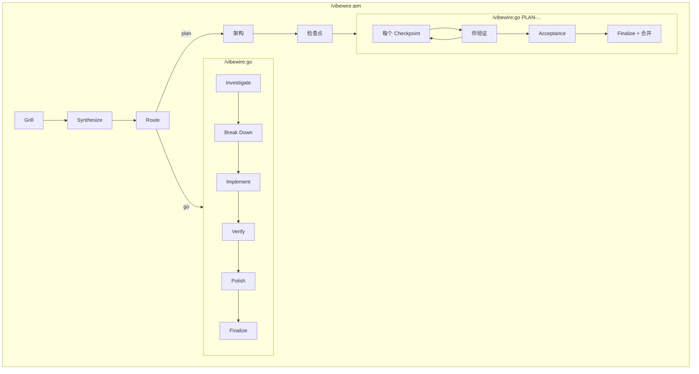

# VibeWire

**中文** | [English](README.md)

Claude Code 的开发工作流插件。Aim 访谈对齐规格；go 负责实现——TDD、审查、提交。

你确认方向。Agent 执行已约定的范围。

---

## 工作原理

先运行 `/vibewire:intro` 扫描代码库，建立文档基线（每个项目一次）。

按工作选择 skill：

- **Aim** — 探索、研究、讨论和架构规划。按 frontier 轮次访谈直到共享理解，域语言与 ADR 在结晶时写入。可选合成 to-spec 风格的 AIM，再路由：**go** 或 **plan**。你确认选哪条、本会话还是新会话。事实或假设需要查证时派遣 scout / experimenter——它们不做决策。
- **Go** — 明确的实现。调查 → 分解 → TDD（或直接改）→ 验证 → 打磨 → 收尾。Ad-hoc go 在启动三名外审前询问；PLAN 执行始终启动外审。

所有过程产物在项目内的 `.vibewire/`——架构、检查点计划、AIM 文档和经验日志。一切透明。

---

## 安装

### Claude Code（通过插件市场）

先注册市场，然后安装插件：

```bash
claude plugins marketplace add https://github.com/owniai/vibewire
claude plugins install vibewire@vibewire
```

---

## 快速开始

```bash
# 第 1 步：扫描项目（运行一次）
/vibewire:intro

# 第 2 步：选择 skill
/vibewire:aim   # 探索、澄清，路由到 go 或 plan
/vibewire:go    # 实现：调查 → TDD → 验证 → 打磨 → 提交
```

---

## 工作流

| 命令 / Skill | 用途 | 何时使用 |
|-------|------|----------|
| `/vibewire:intro` | 扫描项目，建立文档基线 | 每个项目一次，或代码库发生重大变化时 |
| `/vibewire:aim` | 探索、澄清和架构规划 | 需要在编码前探索、分析、决策或规划时 |
| `/vibewire:go` | TDD 实现与审查 | 知道要构建什么，或执行一份 PLAN 时 |

```
/vibewire:intro → .vibewire/project.md, .vibewire/CHANGELOG.md

/vibewire:aim:
  → Grill（frontier 轮次；内联 `.vibewire/CONTEXT.md` + `.vibewire/adr/`）
  → Synthesize（to-spec 风格 AIM，或跳过）→ Route
  → Route：推荐 **go** 或 **plan**；你确认选哪条、本会话还是新会话
  → （可选）`.vibewire/aims/AIM-{N}-{name}.md`

  plan:
      → 架构（逐层确认）→ 写入 architecture.md
      → 检查点（全部批准）→ 写入 checkpoints.md
      → Route：询问提交，然后 `/vibewire:go PLAN-{N}-{name}`

/vibewire:go（ad-hoc）:
  → Investigate → 确认
  → Break Down → 确认
  → Implement（TDD red → green，或 Direct）逐个原子变更
  → Verify（完整测试套件）
  → Polish（自审；启动 3 名外审前询问）
  → Finalize（`.vibewire/CHANGELOG.md`、`.vibewire/evolve.md`）→ 提交

/vibewire:go PLAN-{N}-{name}:
  → 分支 `plan/PLAN-{N}-{name}`
  → 每个 Checkpoint：Phase 1–5（Polish 始终启动外审）
      → 你验证 → 收尾 `log.md` → 提交
  → Acceptance → Finalize（一条 changelog）→ 合并（你确认）
```

---

## 内容概览

### Commands（1 个）

| Command | 描述 |
|---------|------|
| **intro** | 扫描代码库，建立文档基线（`.vibewire/project.md` 含 Vibewire artifacts 索引、`.vibewire/CHANGELOG.md`）。五步：确认范围 → 探索 → 写文档 → 审查 → 提交 |

### Skills（2 个）

| Skill | 描述 |
|-------|------|
| **aim** | 访谈并记录域记忆，可选 to-spec 风格 AIM，再路由到 **go** 或 **plan**。CONTEXT/ADR 懒创建；需要架构时产出 PLAN |
| **go** | 调查 → 分解 → 实现（TDD 或直接改）→ 验证 → 打磨 → 收尾。Ad-hoc，或执行 `PLAN-{N}-{name}` 检查点 |

### Agents（5 个）

| Agent | 职责 | 使用方 |
|-------|------|--------|
| **scout** | 调查指定技术和依赖——版本、兼容性、约束。接收研究目标，不做决策 | aim |
| **experimenter** | 运行指定实验，获取真实结构、API 行为或性能数据。接收实验目标，不做决策 | aim |
| **efficiency-reviewer** | 审查性能——不必要的计算、错失的并发、内存泄漏、算法低效 | go |
| **quality-reviewer** | 审查反模式——冗余状态、参数膨胀、复制粘贴变体、过度抽象、代码异味 | go |
| **reuse-reviewer** | 审查重复代码——搜索已有工具函数和模式，识别可复用机会 | go |

---

## 架构

### 过程产物

所有过程产物存放在目标项目的 `.vibewire/` 目录：

```
.vibewire/
├── project.md                          # 项目概览（由 intro 创建；含 Vibewire artifacts 索引）
├── CONTEXT.md                          # 域术语表（懒创建；由 aim 访谈过程写入）
├── adr/                                # 架构决策记录（懒创建；由 aim 写入）
│   └── 0001-{slug}.md
├── CHANGELOG.md                        # 变更日志（由 intro 创建；go finalize 更新）
├── evolve.md                           # 可复用经验（由 go 维护）
├── tech-research/                      # 技术调研产物（由 scout 创建）
│   ├── knowledge.md                    # 全局调研知识库
│   └── {task-id}.md                    # 每个任务的详细调研
├── experiments/
│   ├── framework.md                    # 全局实验框架（由 experimenter 创建）
│   └── {task-id}/                      # 实验结果（由 experimenter 创建）
│       └── result.md
├── plans/
│   └── PLAN-{N}-{name}/
│       ├── architecture.md             # 架构（层确认后写入）
│       ├── checkpoints.md              # 交付检查点 + 状态头
│       └── log.md                      # 每 Checkpoint 的 drift + notes（由 go 创建）
└── aims/
    └── AIM-{N}-{name}.md               # to-spec 风格综合（可选）
```

### Agent 流水线



---

## 设计理念

- **你确认方向** — Skill 给推荐；你确认路由、提交，以及（ad-hoc）是否外审。
- **审查在回路里** — 始终自审。外审需询问；PLAN 执行始终外审。
- **过程可追溯** — 决策与交付留在 `.vibewire/`。
- **有判断地修复** — 合并发现；修能改进这次变更的，跳过破坏更大的。

---

## 更新

```bash
claude plugins update vibewire@vibewire
```

---

## 致谢

VibeWire 受到了 Jesse Vincent 的 [Superpowers](https://github.com/obra/superpowers) 项目启发。以下模式和概念改编自 Superpowers：

- **Skill 格式** — 使用 YAML frontmatter 元数据和结构化章节来描述流程、原则和反模式的 Markdown 格式
- **设计先行工作流** — 在任何实现开始之前要求用户批准设计文档

## 许可证

MIT License - 详见 LICENSE 文件。
