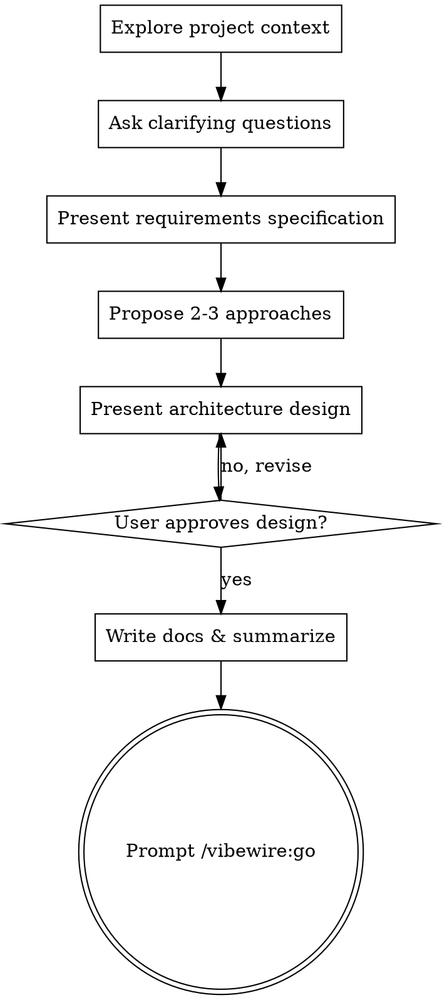

# Plan：从任务到规划

## 概述

通过自然的协作对话，帮助将用户任务转化为完整的需求文档和架构设计。

首先深度探索当前项目上下文，然后逐一提问以澄清需求。理解需求后呈现详述并写入需求文档，接着提出多个架构方案供用户选择，最后呈现设计并获得用户批准。

<HARD-GATE>
在呈现设计并获得用户批准之前，不要调用任何实现技能、编写任何代码或采取任何实现行动。这适用于每个项目，无论感知的简单程度如何。
</HARD-GATE>

## 反模式："这太简单了不需要规划"

每个项目都要经过这个过程。简单的功能、配置更改——所有这些。"简单"的项目是未审视的假设导致最多浪费工作的地方。规划可以很短（对于真正简单的项目只需几句话），但你必须呈现它并获得批准。

## 检查清单

你必须为以下每个项目创建任务并按顺序完成：

1. **探索项目上下文** — 检查 .vibewire/ 目录，深度探索文件、文档、最近提交、相关代码
2. **提出澄清问题** — 一次一个，理解目的/约束/成功标准
3. **呈现需求详述** — 写入 .vibewire/{seq}-{name}/requirements.md
4. **提出2-3个方案** — 附带权衡和你的建议
5. **呈现架构设计** — 按复杂度缩放各部分，每部分后获得用户确认
6. **编写规划文档** — 写入 .vibewire/{seq}-{name}/architecture.md
7. **过渡到执行** — 总结对话，提示用户使用 /vibewire:go

## 流程图



**终止状态是提示用户使用 /vibewire:go。** 不要调用任何实现技能。plan 之后用户需要运行 /vibewire:go 来开始执行。

## 流程

### 1. 探索项目上下文

创建规划目录：`.vibewire/{seq}-{name}/`

- 序号：三位数字自动递增（001, 002...）
- 名称：任务对应的英文标识，kebab-case（如 `user-auth`）

深度探索项目：
- 读取项目目录结构
- 读取 README、package.json、配置文件等基础信息
- 读取 docs/ 目录下的文档
- 检查最近的 git 提交历史
- 读取与任务相关的代码文件

### 2. 需求澄清

理解想法：

- 逐一提问以完善需求
- 尽可能使用选择题，但开放性问题也可以
- 每条消息只问一个问题 — 如果某个主题需要更多探索，将其拆分为多个问题
- 重点关注理解：目的、约束、成功标准

### 3. 呈现需求详述

一旦你理解了需求：

- 呈现需求详述给用户确认
- 获得确认后，写入 `.vibewire/{seq}-{name}/requirements.md`
- 涵盖：任务概述、功能需求、非功能需求、约束条件、成功标准

### 4. 探索方案

提出2-3个不同的架构方案：

- 每个方案附带权衡分析
- 以对话方式呈现选项，附上你的建议和理由
- 首先提出你推荐的选项并解释原因
- 让用户选择或提出修改意见

### 5. 呈现架构设计

基于选定的方案呈现详细设计：

- 按复杂度缩放每个部分：如果简单则几句话，如果复杂则更详细
- 每个部分后询问目前看起来是否正确
- 涵盖：架构概览、技术栈、模块划分、数据流、接口设计、错误处理、测试策略
- 准备好返回去澄清如果不合理的地方

### 6. 编写规划文档

获得用户确认后，写入架构文档 `.vibewire/{seq}-{name}/architecture.md`

### 7. 过渡到执行

总结对话并提示用户下一步：

**总结对话：**
- 将交互过程总结保存到 `.vibewire/{seq}-{name}/planning-session.md`
- 记录关键决策点和理由
- 记录用户的偏好和约束
- 便于在新会话中恢复上下文
- 不是原样保存对话，而是提炼关键信息

**提示用户：**

```
规划已完成！需求文档和架构设计已保存到 .vibewire/{seq}-{name}/ 目录。

下一步：
- 当前会话：直接运行 /vibewire:go 开始执行
- 新会话：在新会话中运行 /vibewire:go，系统会读取最新的规划文档
```

## 关键原则

- **一次一个问题** — 不要用多个问题淹没用户
- **优先选择题** — 在可能的情况下比开放性问题更容易回答
- **严格执行YAGNI** — 从所有设计中删除不必要的功能
- **探索替代方案** — 在确定之前始终提出2-3个方案
- **增量验证** — 呈现设计，在继续之前获得批准
- **保持灵活** — 当某些内容不合理时返回去澄清
- **深度探索上下文** — 充分了解项目现状再做规划
- **总结而非记录** — 对话总结提炼关键信息，不是原始记录

## 输出文件

| 文件 | 内容 | 写入时机 |
|------|------|----------|
| `.vibewire/{seq}-{name}/requirements.md` | 需求分析文档 | 需求澄清完成并确认后 |
| `.vibewire/{seq}-{name}/architecture.md` | 架构设计文档 | 架构设计确认后 |
| `.vibewire/{seq}-{name}/planning-session.md` | 对话总结 | 架构设计确认后，提示 /vibewire:go 前 |
