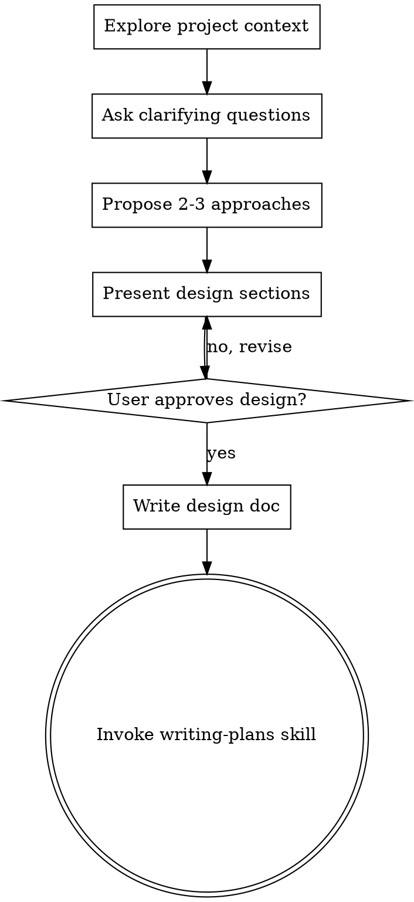

# 头脑风暴：从想法到设计

## 概述

通过自然的协作对话，帮助将想法转化为完整形成的设计和规格。

首先理解当前项目上下文，然后逐一提问以完善想法。一旦你理解了要构建什么，呈现设计并获得用户批准。

<HARD-GATE>
在呈现设计并获得用户批准之前，不要调用任何实现技能、编写任何代码、搭建任何项目或采取任何实现行动。这适用于每个项目，无论感知的简单程度如何。
</HARD-GATE>

## 反模式："这太简单了不需要设计"

每个项目都要经过这个过程。待办事项列表、单函数工具、配置更改——所有这些。"简单"的项目是未审视的假设导致最多浪费工作的地方。设计可以很短（对于真正简单的项目只需几句话），但你必须呈现它并获得批准。

## 检查清单

你必须为以下每个项目创建任务并按顺序完成：

1. **探索项目上下文** — 检查文件、文档、最近提交
2. **提出澄清问题** — 一次一个，理解目的/约束/成功标准
3. **提出2-3个方案** — 附带权衡和你的建议
4. **呈现设计** — 按复杂度缩放各部分，每部分后获得用户批准
5. **编写设计文档** — 保存到 `docs/plans/YYYY-MM-DD-<topic>-design.md` 并提交
6. **过渡到实现** — 调用 writing-plans 技能创建实现计划

## 流程图

**终止状态是调用 writing-plans。** 不要调用 frontend-design、mcp-builder 或任何其他实现技能。头脑风暴之后你唯一调用的技能是 writing-plans。

## 流程

**理解想法：**
- 首先检查当前项目状态（文件、文档、最近提交）
- 逐一提问以完善想法
- 尽可能使用选择题，但开放性问题也可以
- 每条消息只问一个问题 — 如果某个主题需要更多探索，将其拆分为多个问题
- 重点关注理解：目的、约束、成功标准

**探索方案：**
- 提出2-3个不同的方案及其权衡
- 以对话方式呈现选项，附上你的建议和理由
- 首先提出你推荐的选项并解释原因

**呈现设计：**
- 一旦你认为你理解了要构建什么，呈现设计
- 按复杂度缩放每个部分：如果简单则几句话，如果复杂则最多200-300字
- 每个部分后询问目前看起来是否正确
- 涵盖：架构、组件、数据流、错误处理、测试
- 准备好返回去澄清如果不合理的地方

## 设计之后

**文档化：**
- 将验证过的设计写入 `docs/plans/YYYY-MM-DD-<topic>-design.md`
- 如果可用，使用 elements-of-style:writing-clearly-and-concisely 技能
- 将设计文档提交到 git

**实现：**
- 调用 writing-plans 技能创建详细的实现计划
- 不要调用任何其他技能。writing-plans 是下一步。

## 关键原则

- **一次一个问题** — 不要用多个问题淹没用户
- **优先选择题** — 在可能的情况下比开放性问题更容易回答
- **严格执行YAGNI** — 从所有设计中删除不必要的功能
- **探索替代方案** — 在确定之前始终提出2-3个方案
- **增量验证** — 呈现设计，在继续之前获得批准
- **保持灵活** — 当某些内容不合理时返回去澄清
