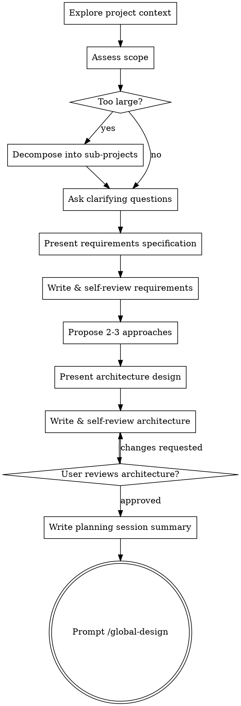

# Spec：从任务到规格

## 概述

通过协作对话将用户任务转化为 requirements.md + architecture.md，并维护项目文档（project.md、CHANGELOG.md）。

<HARD-GATE>
在用户审阅并批准架构设计文档之前，不要调用任何实现技能、编写任何代码或采取任何实现行动。这适用于每个项目，无论感知的简单程度如何。
</HARD-GATE>

## 反模式："这太简单了不需要规划"

每个项目都要经过这个过程。简单的功能、配置更改——所有这些。"简单"的项目是未审视的假设导致最多浪费工作的地方。规划可以很短（对于真正简单的项目只需几句话），但你必须呈现它并获得批准。

## 检查清单

你必须为以下每个项目创建任务并按顺序完成：

1. **探索项目上下文** — 读取项目文档，通过 Explore subagent 补充探索
2. **评估任务范围** — 判断任务是否需要拆分为独立子项目
3. **提出澄清问题** — 一次一个，理解目的/约束/成功标准
4. **呈现需求详述** — 向用户展示完整需求描述
5. **写入并自检需求文档** — 写入 requirements.md，自检占位符/矛盾/歧义/范围
6. **提出2-3个方案** — 附带权衡和你的建议
7. **呈现架构设计** — 仅需求级增量：模块划分、数据流；项目级决策同步更新 project.md
8. **写入并自检架构文档** — 写入 architecture.md，更新 project.md 和 CHANGELOG.md，自检
9. **用户审阅架构文档** — 请用户审阅架构文档文件
10. **编写规格对话总结** — 写入 spec-session.md
11. **过渡到执行** — 总结对话，提示用户使用 /vibewire:go

## 流程图



**终止状态是提示用户使用 /global-design。** 不要调用任何实现技能。spec 之后用户需要运行 /global-design 来进行全局设计。

## 流程

### 1. 探索项目上下文

**第一步 — 读取项目文档：** 读取 `.vibewire/project.md`（若存在）获取项目全貌（架构、技术栈、目录结构、约定）和 `.vibewire/CHANGELOG.md`（若存在）了解演进历史。

**第二步 — 派发 Explore subagent：** 补充项目文档之外的细节信息：

```
subagent_type: "Explore"
description: "探索项目上下文"
prompt: |
  我已通过项目文档了解了项目全貌，需要你补充以下细节信息。

  先读取以下项目文档作为已有上下文（若存在）：
  - .vibewire/project.md
  - .vibewire/CHANGELOG.md

  在此基础上补充探索：
  - 与用户任务相关的代码文件及其当前实现状态
  - 最近 20 条 git 提交历史中的开发动态
  - 项目文档中未记录的最新变化（新增文件、依赖变更、配置调整等）
  - 与任务相关的现有代码模式、约定、潜在约束
```

两步完成后，基于完整上下文进入下一步。

### 2. 评估任务范围

在深入需求澄清之前，评估任务规模：

- 如果任务描述了多个独立子系统（如"构建一个包含聊天、文件存储、计费和分析的平台"），立即标记
- 不要花大量问题去细化一个需要拆分的项目的细节
- 如果项目对单个规划来说太大，帮助用户拆分为子项目：哪些是独立的部分，它们如何关联，应该以什么顺序构建？然后对第一个子项目走正常的规划流程
- 每个子项目拥有自己的 spec→global-design→go 周期

### 3. 需求澄清

理解想法：

- 逐一提问以完善需求
- 尽可能使用选择题，但开放性问题也可以
- 每条消息只问一个问题 — 如果某个主题需要更多探索，将其拆分为多个问题
- 重点关注理解：目的、约束、成功标准

### 4. 呈现需求详述

一旦你理解了需求：

- 呈现需求详述给用户确认
- 涵盖：任务概述、功能需求、非功能需求、约束条件、成功标准

### 5. 写入并自检需求文档

获得用户确认后，初始化项目仓库并创建规划目录：

**初始化 Git：**

- 检测当前目录是否为 git 仓库，若不是则 `git init` 初始化
- 根据项目信息（语言、框架等）创建或更新 `.gitignore`
- 若仓库无任何提交，创建初始提交

**创建规划目录：** `.vibewire/{seq-name}/`

- 检查 `.vibewire/` 目录是否存在，不存在则创建
- 扫描 `.vibewire/` 下已有的 `{seq-name}/` 目录，确定当前最大序号
- 序号：三位数字，在已有最大序号基础上递增（无已有目录则从 001 开始）
- 名称：任务对应的英文标识，kebab-case（如 `user-auth`）

写入 `.vibewire/{seq-name}/requirements.md`

**初始化项目文档（仅首次 spec）：**

若 `.vibewire/project.md` 不存在，创建并写入基于 step 1 探索结果的项目文档：

```markdown
> 版本：{seq} | 最后更新：来自 {seq-name}

# 项目概述
[一段话描述项目是什么、解决什么问题]

# 当前架构
[已有模块及其职责、模块间关系]

# 目录结构
[按模块组织的文件列表，每个文件附简要职责描述]

# 技术栈
[技术决策：语言、框架、数据库、关键依赖]

# 约定与规范
[编码规范、目录约定、公共模式]
```

同时创建 `.vibewire/CHANGELOG.md`：

```markdown
# 变更记录

## {seq-name}
- 初始化项目技术栈：[技术栈概要]
- [其他初始化内容]
```

**文档自检：**
写入后立即自检，无需重新审阅——修复后继续：

1. **占位符扫描** — 是否有"TBD"、"TODO"、不完整部分或模糊需求？修复它们
2. **内部一致性** — 各部分是否互相矛盾？需求是否与项目上下文一致？
3. **范围检查** — 是否聚焦于一个可实现的范围，还是需要拆分？
4. **歧义检查** — 是否有需求可以被两种不同方式解读？如有，选择一种并明确说明

### 6. 探索方案

提出2-3个不同的架构方案：

- 每个方案附带权衡分析
- 以对话方式呈现选项，附上你的建议和理由
- 首先提出你推荐的选项并解释原因
- 让用户选择或提出修改意见

### 7. 呈现架构设计

基于选定的方案呈现需求级架构设计。仅关注**本需求的架构增量**，项目级决策（技术栈、错误处理策略、测试策略）沿用 `project.md` 或在此提出变更。

**覆盖范围：**

- **架构概览** — 本需求在当前架构中的位置和整体方案
- **模块划分** — 新增/变更哪些模块，每个模块的单一职责
- **数据流** — 模块间的数据流转方向和通信模式

**不包含**（属于其他层级）：
- 技术栈、错误处理策略、测试策略 → `project.md`
- 接口签名、数据 schema → stage/task 级别（实现阶段）

按复杂度缩放每个部分：如果简单则几句话，如果复杂则更详细（最多200-300字）。每个部分后询问目前看起来是否正确。

**模块化设计：**

- 将系统拆分为更小的单元，每个单元有单一明确的用途，通过定义良好的接口通信，可独立理解和测试
- 对每个单元应能回答：它做什么，怎么使用，依赖什么？
- 能否在不阅读内部实现的情况下理解一个单元的用途？能否在不破坏消费者的情况下修改内部实现？如果不能，边界需要调整

**在现有代码库中工作：**

- 先探索现有结构，遵循既有模式
- 当现有代码存在影响当前工作的问题（如文件过大、边界不清、职责纠缠）时，将针对性改进作为设计的一部分
- 不要提出无关的重构，保持聚焦于当前目标

**项目级决策变更：**

如果本需求需要变更 `project.md` 中的项目级决策（如新增依赖、变更技术栈），在此一并提出并说明理由，获得用户确认。

### 8. 写入并自检架构文档

获得用户确认后，写入架构文档 `.vibewire/{seq-name}/architecture.md`，并同步更新项目级文档。

**写入 architecture.md：** 仅包含需求级架构增量（模块划分、数据流），不含项目级信息。

**更新 project.md：**

将本需求的架构增量合并到项目文档中：
- 更新首行元信息：`> 版本：{seq} | 最后更新：来自 {seq-name}`
- 更新"当前架构"段落：新增/变更的模块及其职责
- 更新"目录结构"段落：新增/变更的文件及其职责描述
- 若有项目级决策变更（step 7 中确认的），更新"技术栈"或"约定与规范"段落

**追加 CHANGELOG.md：**

在文件顶部追加本需求的变更条目：

```markdown
## {seq-name}
- 新增模块：[模块名及职责]
- 变更：[变更的模块/文件及原因]
```

**文档自检：**
与需求文档相同的自检流程——扫描占位符、内部一致性、范围、歧义。修复后继续。

额外检查 architecture.md 与 project.md 的一致性：architecture.md 中的模块是否已反映到 project.md 的"当前架构"和"目录结构"中。

### 9. 用户审阅架构文档

架构文档写入并自检后，请用户审阅文档文件：

> 架构设计文档已写入 `.vibewire/{seq-name}/architecture.md`。请审阅文件内容，如有需要修改的地方请告知，确认无误后我们将进入执行阶段。

等待用户响应。如用户要求修改，修改后重新自检再请用户审阅。仅在用户确认后继续。

### 10. 编写规格对话总结

将交互过程总结保存到 `.vibewire/{seq-name}/spec-session.md`：
- 记录关键决策点和理由
- 记录用户的偏好和约束
- 便于在新会话中恢复上下文
- 不是原样保存对话，而是提炼关键信息

提交规划文档：

```
git add .vibewire/
git commit -m "[{seq-name}] docs: 规划文档"
```

### 11. 过渡到执行

提示用户下一步：

```
规划已完成！需求文档和架构设计已保存到 .vibewire/{seq-name}/ 目录。

下一步：
- 当前会话：直接运行 /global-design 进行全局设计
- 新会话：在新会话中运行 /global-design，系统会读取最新的规划文档
```

## 关键原则

- **一次一个问题** — 不要用多个问题淹没用户
- **优先选择题** — 在可能的情况下比开放性问题更容易回答
- **严格执行YAGNI** — 从所有设计中删除不必要的功能
- **探索替代方案** — 在确定之前始终提出2-3个方案
- **增量验证** — 呈现设计，在继续之前获得批准
- **保持灵活** — 当某些内容不合理时返回去澄清
- **深度探索上下文** — 充分了解项目现状再做规划
- **模块化设计** — 系统应拆分为边界清晰、可独立理解的单元
- **总结而非记录** — 对话总结提炼关键信息，不是原始记录
